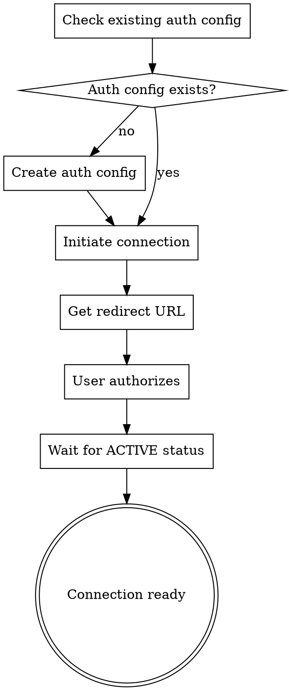

# Composio Connections

Manage user connections to external services (Gmail, GitHub, Slack, etc.) via Composio API.

## Prerequisites

- Composio API key set in environment: `COMPOSIO_API_KEY`
- Install SDK: `npm install @composio/core zod`

## Quick Reference

| Task | Method |
|------|--------|
| List connections | `connectedAccounts.list()` |
| Initiate OAuth | `connectedAccounts.initiate(userId, authConfigId)` |
| Get connect link | `connectedAccounts.link(userId, authConfigId)` |
| Wait for connection | `connectionRequest.waitForConnection()` |
| Delete connection | `connectedAccounts.delete(id)` |
| Check connection | `connectedAccounts.get(id)` |

## Connection Flow



## Authentication Types

### 1. OAuth2 (Gmail, GitHub, Slack, Google Workspace)

```javascript
const { Composio } = require('@composio/core');

const composio = new Composio({
  apiKey: process.env.COMPOSIO_API_KEY
});

// Initiate connection
const connectionRequest = await composio.connectedAccounts.initiate(
  'user-123',           // Unique user ID in your system
  'ac_abc123',          // Auth config ID from dashboard
);

console.log('Redirect URL:', connectionRequest.redirectUrl);
// User opens this URL to authorize

// Wait for connection to complete
const connectedAccount = await connectionRequest.waitForConnection();
console.log('Status:', connectedAccount.status); // 'ACTIVE'
```

### 2. OAuth2 with Additional Parameters (Zendesk, Posthog)

```javascript
const connectionRequest = await composio.connectedAccounts.initiate(
  'user-123',
  'ac_zendesk',
  { config: { subdomain: 'your-company' } }
);
```

### 3. API Key (Stripe, Perplexity)

```javascript
const connectionRequest = await composio.connectedAccounts.initiate(
  'user-123',
  'ac_stripe',
  { config: { api_key: 'sk_live_xxx' } }
);

// No redirect URL - connection is immediate
const connectedAccount = await connectionRequest.waitForConnection();
```

### 4. Basic Auth

```javascript
const connectionRequest = await composio.connectedAccounts.initiate(
  'user-123',
  'ac_basic',
  { config: { username: 'user', password: 'pass' } }
);
```

## Common Operations

### List All Connections

```javascript
const connections = await composio.connectedAccounts.list();
console.log(`Total: ${connections.items.length}`);

connections.items.forEach(conn => {
  console.log(`${conn.toolkit.slug}: ${conn.status}`);
});
```

### Filter Connections

```javascript
// By user
const userConnections = await composio.connectedAccounts.list({
  userIds: ['user-123']
});

// By toolkit
const githubConnections = await composio.connectedAccounts.list({
  toolkitSlugs: ['github']
});

// By status
const activeConnections = await composio.connectedAccounts.list({
  statuses: ['ACTIVE']
});
```

### Delete All Connections

```javascript
const connections = await composio.connectedAccounts.list();

for (const conn of connections.items) {
  await composio.connectedAccounts.delete(conn.id);
  console.log(`Deleted: ${conn.toolkit.slug}`);
}
```

### Check Connection Status

```javascript
const account = await composio.connectedAccounts.get('ca_xxx');
console.log('Status:', account.status);
// ACTIVE, INITIATED, EXPIRED, FAILED, INACTIVE
```

## Auth Config Management

### List Auth Configs

```javascript
const authConfigs = await composio.authConfigs.list({
  toolkitSlugs: ['gmail']
});

authConfigs.items.forEach(config => {
  console.log(`${config.name}: ${config.id}`);
});
```

### Create Auth Config (Composio Managed)

```javascript
const authConfig = await composio.authConfigs.create({
  name: 'Gmail OAuth',
  toolkit: { slug: 'gmail' },
  authMode: 'OAUTH2',
  useComposioManagedAuth: true
});

console.log('Auth Config ID:', authConfig.id);
```

## Hosted Connect Link

For a Composio-hosted authentication page (white-labeled option):

```javascript
const connectionRequest = await composio.connectedAccounts.link(
  'user-123',
  'ac_abc123',
  { callbackUrl: 'https://your-app.com/callback' }
);

// Redirect user to this URL
console.log('Connect Link:', connectionRequest.redirectUrl);

// Wait for completion
const connectedAccount = await connectionRequest.waitForConnection();
```

## Connection Statuses

| Status | Description |
|--------|-------------|
| `ACTIVE` | Ready to use |
| `INITIATED` | Waiting for user authorization |
| `PENDING` | Being processed |
| `EXPIRED` | Credentials expired, needs re-auth |
| `FAILED` | Connection attempt failed |
| `INACTIVE` | Temporarily disabled |

## Direct API Calls (Without SDK)

If SDK is unavailable, use direct HTTP calls:

```javascript
const https = require('https');

// List connections
const listConnections = () => new Promise((resolve, reject) => {
  const req = https.request({
    hostname: 'backend.composio.dev',
    path: '/api/v1/connectedAccounts',
    method: 'GET',
    headers: { 'x-api-key': process.env.COMPOSIO_API_KEY }
  }, (res) => {
    let data = '';
    res.on('data', (chunk) => data += chunk);
    res.on('end', () => resolve(JSON.parse(data)));
  });
  req.on('error', reject);
  req.end();
});

// Delete connection
const deleteConnection = (id) => new Promise((resolve, reject) => {
  const req = https.request({
    hostname: 'backend.composio.dev',
    path: `/api/v1/connectedAccounts/${id}`,
    method: 'DELETE',
    headers: { 'x-api-key': process.env.COMPOSIO_API_KEY }
  }, (res) => {
    let data = '';
    res.on('data', (chunk) => data += chunk);
    res.on('end', () => resolve({ id, status: res.statusCode }));
  });
  req.on('error', reject);
  req.end();
});
```

## Common Mistakes

| Mistake | Fix |
|---------|-----|
| Missing `user_id` | Always provide unique user identifier |
| Wrong `authConfigId` | Check dashboard for correct ID |
| Not waiting for connection | Use `waitForConnection()` before executing tools |
| Using old API version | Use v3 endpoints or latest SDK |
| Expired connection | Re-initiate OAuth flow |

## Error Handling

```javascript
try {
  const connectionRequest = await composio.connectedAccounts.initiate(
    userId,
    authConfigId
  );
} catch (error) {
  if (error.code === 'VALIDATION_ERROR') {
    console.log('Invalid parameters:', error.possibleFixes);
  } else if (error.message.includes('auth config')) {
    console.log('Auth config not found, create one first');
  }
}
```
